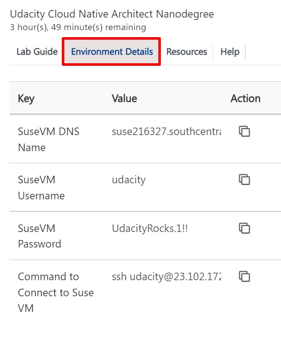
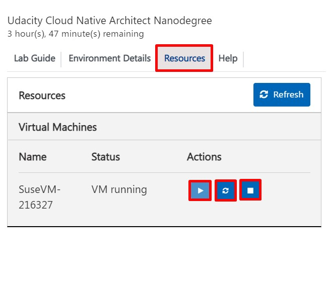

# Getting Started with Lab

1. Once the environment is provisioned, a virtual machine and lab guide will get loaded in your browser. Use this virtual machine throughout the workshop to perform the the lab.

2. To get the lab environment details, you can select **Environment Details** tab. 

   
 

## Resource Start/Stop

Please follow the below steps to start/stop the VM: 

1. To start/restart/stop the VM, please go to the **Resources** tab and click on the appropriate buttons.

   
   

