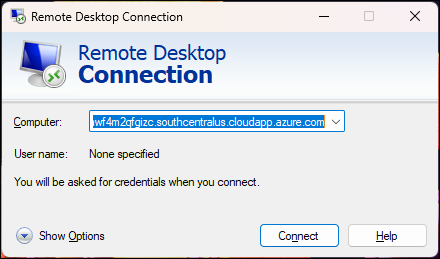

# Getting Started with Lab

1. Once the environment is provisioned, a virtual machine (Kali Linux VM) will get loaded. Use this virtual machine throughout the workshop to perform the the lab.
 
1. To connect to each of these Virtual machines, you need the details like DNS Name or IP address, Username and Password. You can find all these details for all the available virtual machines in the **Environment details** section.
   
   
   
   
1. You can use the DNS Name to RDP to the following machines:

    * Kali Internal
    
1. You can use the DNS Name to SSH to the following machines:
   
    * DMZIServer
    * Debianx64DMZCLoudNew
    
## How to Connect to Kali Internal Linux via RDP

1. Search for Remote Desktop Connection 

2. Select the **Remote Desktop Connection** App
   
   

3. Enter the public IP address of your device.

   

4. Click on **Connect** > **Yes** 
   
   

5. Enter your credentials via **XRDP**
   
   

5. Click **Ok**

6. You should now have access
   
   

## How to connect to DMZIServer via RDP

1. Search for Remote Desktop Connection. 

2. Select the **Remote Desktop Connection** App.
   
   

3. Enter the public IP address of your device.

4. Click on **Connect**.

   

5. If this is your first time remoting to this machine, you will need to manually enter your username by selecting more choices.

    

6. Enter your credentials.

7. Click on **Ok** > **Yes**

   

8. You should now have access.
   
   
