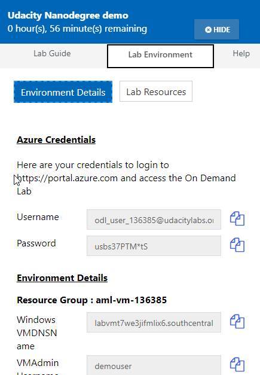
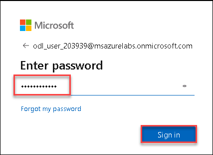
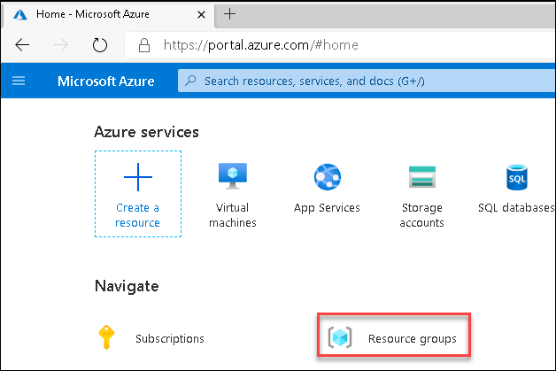
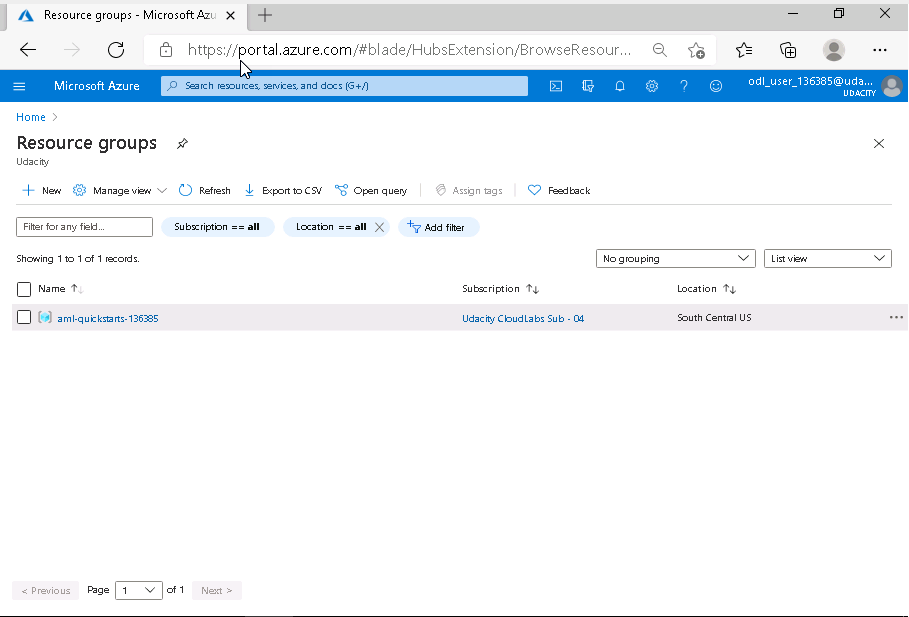

# Getting Started with Lab

1. Once the environment is provisioned, a virtual machine (Kali inux VM) will get loaded. Use this virtual machine throughout the workshop to perform the the lab.
1. To get the lab environment details, you can select **Lab Environment** tab. All the required lab resource details will be available in the Lab environment page.

   
 
## Login to Azure Portal
1. In the Kali VM, open the browser and navigate to https://portal.azure.com
   
2. On **Sign in to Micsoft Azure** tab you will see login screen, in that enter following Azure username and then click on **Next**. 
   * Azure Username: <inject key="AzureAdUserEmail"></inject>
   
     
     
3. Now enter the following Azure password and click on **Sign in**.
   * Azure Password: <inject key="AzureAdUserPassword"></inject>
   
     
     
4. If you see the pop-up **Stay Signed in?**, click No

5. If you see the pop-up **You have free Azure Advisor recommendations!**, close the window to continue the lab.

6. If a **Welcome to Microsoft Azure** popup window appears, click **Maybe Later** to skip the tour.
   
7. Now you will see Azure Portal Dashboard, click on **Resource groups** to see the resource groups.

   
   
8. Confirm you have all resource group are present as shown below.

   
   
9. Now, Open the **Resource group** to see all the resource deployed for you.
10. You can see the virtual machines deployed for you in this resource group.
11. To connect to each of these Virtual machines you need the details like DNS Name or IP address, Username and Password. You can find all these details for all the available virtual machines in the **Lab environment** page under **Environment details** section.
   
   
   
   
### How to Obtain your Machine Public IP so you can connect to it remotely
1. Go to https://portal.azure.com
   
   

2. Search **“virtual machines”**
3. Select the **virtual machine** option under services
   
   

4. Observe the virtual machine dashboard will list all the machines that are available in your environment. 
   
   

5. From the overview tab, copy the **public IP** address of your vm
   
   

6. You can use the public IP address to RDP to the following machines:
    * Kali 
    * Kali Internal
    * Win-10
    * DNSServer
    
7.You can use the public IP to SSH to the following machines: 
    * DMZIServer 
    * Debianx64DMZCLoudNew 
    * Debianx64DMZwebCMSCloud 
    
### How to Connect to Kali/Kali Internal Linux via RDP
1. Search for Remote Desktop Connection 
2. Select the **Remote Desktop Connection** App
   
   

3. Enter the public IP address of your device.

   

4. Click on **Connect** > **Yes** 
   
   

5. Enter your credentials via **XRDP**
   
   

5. Click **Ok**
6. You should now have access
   
   

### How to connect to Win10/ DNSServer via RDP
1. Search for Remote Desktop Connection 
2. Select the **Remote Desktop Connection** App
   
   

3. Enter the public IP address of your device.
4. Click on **Connect****

   

5. If this is your first time remoting to this machine, you will need to manually enter your username by selecting more choices

    

6. Enter your credentials
7. Click on **Ok** > **Yes**

   

8. You should now have access
   
   

## Inactivity Time-out

Please note that, the total lab duration for the project lab will be **8 hours** and environment is configured with inactivity time-out enabled. 
The activity inside the Kali-Internal VM in the lab portal will be tracked. If you left the VM inactive for more than **1 hour**, all the VMs in the environment will get deallocated/stopped. 

To restart the lab,you can start all the VMs from the **Lab environment** page or you can start the VM from Azure portal directly.

If the environment is timed-out and you are trying to access the lab, you will be getting the below screen
You can click on **Refresh** button and try restoring the connection with the Kali-Internal VM screen. If you are not able to connect to the VM, go to **Lab Environment** page.

In the **Lab Environment** page, Select **Lab Resources** and check the status of all the VMs. 

If the status of the VMs are **VM Deallocated**, Start all the VM by clicking on the **Start** button in the **Lab Resources page**. It may ask for confirmation, click **OK** in the confirmation pop-up page to confirm. It will take around 2 minutes to get all the VMs up and running.

Click on the **Refresh** button in the Lab resource page to get the VM Status. Once the VM status is **VM Running**, Click on the **Refresh** button in the VM Screen are to reconnect to the VM.

Now, your connection is restored. You can proceed with the lab.

