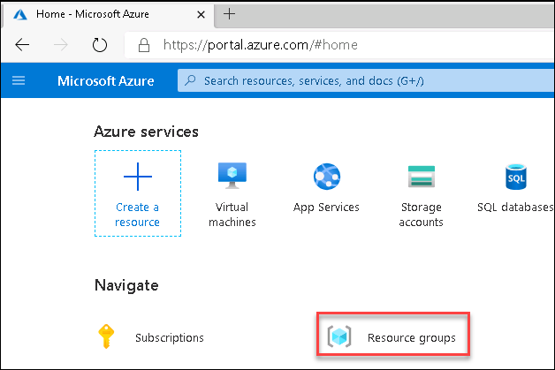

## Getting Started
1. Click on the **ACCESS LAB** button. Wait until the Cloud Lab VM loads (this could take up to 10 minutes) 

2. You can use the Cloud Lab VM either in the classroom or use the generated RDP/SSH credentials to connect from your local machine. Go to the **Lab Environment** tab next to get Azure login credentials and Environment details (RDP/SSH credentials). 
     - For Windows machines, you will get Remote Desktop Connection credentials. 
     - For Linux machines, you will get the SSH login credentials.   
 

## Getting Help
- If you have a technical problem while using your VM, you can send an email to Udacity Support at [udacity-labsupport@udacity.com](mailto:udacity-labsupport@udacity.com). 
- Please be sure to send your message from the email you used to enroll in the Nanodegree program. Use the following email template:   
     - Subject Line: Error in <Lab name>
     - Timestamp and Timezone:
     - Brief description of what you were doing when the issue occurred: 
     - Screenshots:

   

## Logging into the Azure Portal
You can go to the [Azure portal](https://portal.azure.com) to view the current VM and associated resources from your local or current VM's browser.  Here are the signing in steps:
   
1. On [Sign in page](https://azure.microsoft.com/en-in/account/), enter the following email/username and then click on **Next**. 
   * Email/Username: <inject key="AzureAdUserEmail"></inject>
   
     
     
2. Enter the password and click on **Sign in**.
   * Password: <inject key="AzureAdUserPassword"></inject>
   
     
     
3. If you see the pop-up **Stay Signed in?**, click No. 

4. If you see the pop-up **You have free Azure Advisor recommendations!**, close the window to continue the lab.

5. If a **Welcome to Microsoft Azure** pop-up window appears, click **Maybe Later** to skip the tour.
   
6. Now, you will see Azure Portal Dashboard; click on the **Resource groups** to view the resource groups.

   
   
7. Confirm you have default resource group(s) present, as shown below.

   
  

     
## Restrictions 
- Cloud Lab's session time is limited. Your session will expire after the validity expires, and you will lose all your resources in the temporary Azure account. 

- Later, when you come back or refresh the Cloud lab page, you will get a new VM with a new pair of temporary credentials. 

- **You will not be able to create additional Resource Groups.**  There is one resource group already created for you named cloud-demo-XXXXXX.  Choose the existing Resource Group when creating resources.  

- You will not be able to create Active Directory resources. This is not a requirement for any project/exercise.
